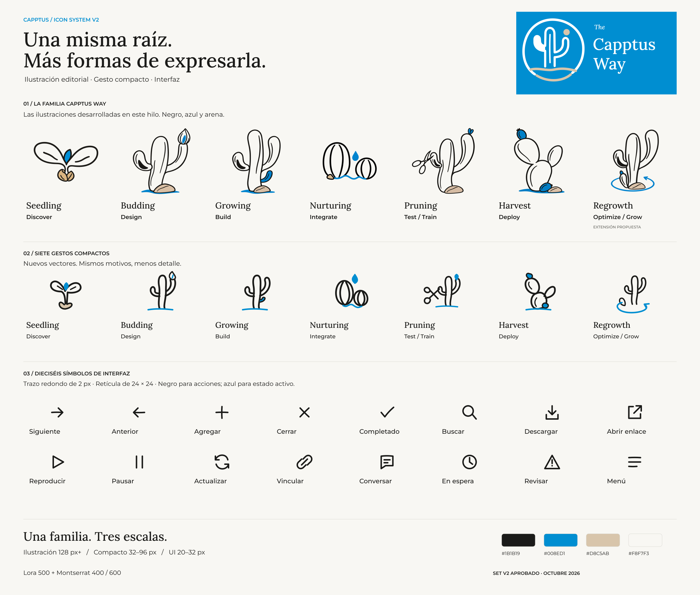
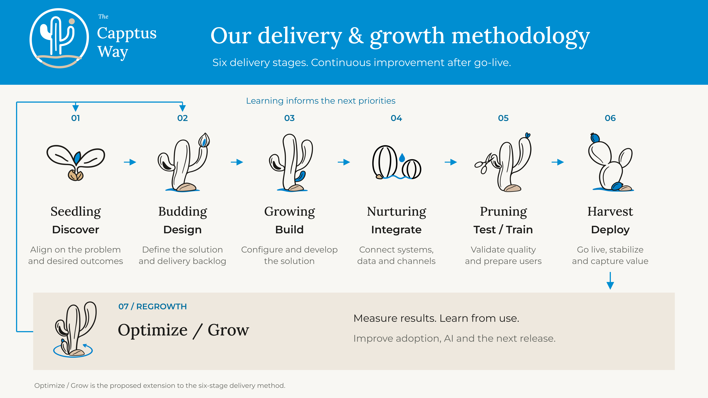
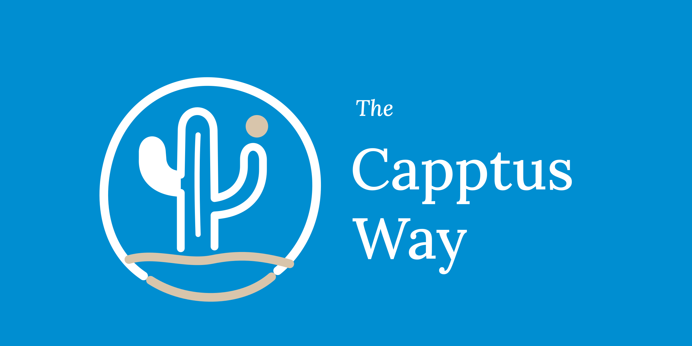

# Capptus Design System

The shared showcase for the Capptus work we have created: **The Living Oasis** direction, the current Capptus Way illustration family, compact icons, interface symbols, and executive diagram.



[Download the current v2 kit](downloads/Capptus-Icon-System-v2.zip) · [Vector reference board](assets/reference/Capptus-Icon-System-v2.svg)

The current family uses organic line art, open interiors, and sparse blue/sand accents. The original corporate Capptus logo is preserved. The compact designs and interface symbols are editable SVG artwork. Typography is approved: **Lora Medium (500)** for h1–h3, highlighted phrases, and quotations, with real **Lora Italic** for one or two emphasized headline words; **Montserrat Regular (400)** for body copy and **Medium (500) / SemiBold (600)** for UI and CTAs. The supporting palette remains proposed.

The v2 board and live showcase use the approved pairing. Earlier moodboards and workshop images are archived examples that retain their original typography.

## The Capptus Way



**Discover → Design → Build → Integrate → Test / Train → Deploy → Optimize / Grow**

The first six stages use the official Seedling, Budding, Growing, Nurturing, Pruning, and Harvest narrative. The seventh is a proposed extension; **Regrowth / Rebrote** is its proposed narrative name. The set uses black organic linework, open interiors, and restrained blue and sand accents.

The selected primary **The Capptus Way** logo is a side-by-side negative lockup, with white lettering and sand accents on Capptus blue. The corporate Capptus logo remains unchanged.



[Download the executive diagram kit](downloads/Capptus-Way-Executive-Diagram-Kit.zip) · [Editable PowerPoint slide](downloads/Capptus-Way-Executive-Diagram.pptx) · [Primary logo kit](downloads/Capptus-Way-Primary-Negative-Kit.zip)

PNG and SVG preserve the approved typography. Install Lora and Montserrat to edit the PowerPoint with the intended fonts; native PowerPoint rendering remains unverified.

[Download the current icon system v2 kit](downloads/Capptus-Icon-System-v2.zip) · [Stage meanings and usage](docs/capptus-way.md)

## What is here

| Collection | Contents |
| --- | --- |
| Creative direction | Baja warmth, cactus resilience, organic linework and editorial typography |
| The Capptus Way | 7 transparent line-art PNGs; 6 official stages + 1 proposed extension |
| Primary Capptus Way logo | Selected negative lockup; transparent and blue SVG/PNG versions |
| Executive methodology diagram | 16:9 PNG, SVG and editable PowerPoint with learning loop |
| Compact icon family v2 | 7 native SVG masters; transparent 32/64/128/256px PNG exports |
| Interface icons v2 | 16 native SVG masters; 24px grid and 2px round strokes |
| Archived v1 artwork | Earlier illustrations, emojis, interface icons and logo proposals retained separately |
| Creation prompt | Regular + negative rules for industry symbols, flows and abstract concepts |
| Digital foundations | Token source, CSS components, and accessibility guidance |

## Creating new icons

[Read or copy the team master prompt](docs/icon-style-master-prompt.md) to create industry symbols, flowchart concepts, and abstract ideas in the current Capptus style.

**Regular:** ink #1B1B19 linework with blue #008ED1 and sand #D8C5AB accents, on white or limestone #F8F7F3. **Negative:** white #FFFFFF linework with sparse sand accents, on Capptus blue #008ED1. Preserve the same silhouette, proportions and visual weight across both modes.

Use rounded organic lines, gentle asymmetry and open interiors. Keep artwork flat and readable. The cactus inspires the language; each subject should communicate its own meaning. The downloadable v2 kit includes the prompt.

Earlier moodboards, workshop excerpts and artwork are available in the [historical archive](docs/archive.md); use the current v2 board and executive diagram for new work.

## Download the assets

- [Current icon system v2 kit ZIP](downloads/Capptus-Icon-System-v2.zip)
- [Current icon reference sheet](assets/reference/Capptus-Icon-System-v2.svg)
- [Archived v1 kit and explorations](docs/archive.md)
- [Master prompt: regular and negative](docs/icon-style-master-prompt.md)
- [Asset catalog](assets/catalog.json)
- [Current icon usage notes](docs/icon-emoji-usage.txt)
- [Current icon tokens](tokens/icon-emoji.tokens.json)
- [Foundation tokens](tokens/tokens.json)

## Preview and use

Open `index.html` in a browser for the interactive showcase. Search in English or Spanish, filter by asset family, and download individual files. It works offline with locally bundled fonts and no external runtime dependencies. For a local server, run `python3 -m http.server 8080` from this folder and visit `http://localhost:8080`.

GitHub renders this visual README. The interactive HTML runs locally or on a separately configured static host.

Use `styles/tokens.css`, `styles/typography.css`, then `styles/components.css` in a website. Components use native HTML and namespaced `.cap-*` classes. The reference page stylesheet is separate from the reusable component styles.

```html
<link rel="stylesheet" href="styles/tokens.css">
<link rel="stylesheet" href="styles/typography.css">
<link rel="stylesheet" href="styles/components.css">
<a class="cap-button" href="/contact">Start a conversation</a>
```

## Repository map

- `tokens/tokens.json` — editable token source with status and provenance.
- `scripts/build.mjs` — generates CSS custom properties and the showcase page.
- `scripts/showcase.mjs` — editable gallery composition using the asset catalog.
- `styles/` — generated tokens, reusable components, and gallery layout.
- `assets/` — original logo, current illustration/compact/UI assets, and archived reference material.
- `downloads/` — supplied ZIP and editable reference boards.
- `docs/foundations.md` — visual rules, accessibility decisions, and open decisions.
- `docs/provenance.md` — source records and asset hashes.
- `CONTRIBUTING.md` — how to change and review the system.
- `AGENTS.md` — rules for AI-assisted work in this repository.

## Verification

Node.js 20 or newer is sufficient; no package installation is required.

```sh
npm run build
npm run check
```

The check verifies generated CSS and HTML consistency, all 30 current catalog records, file hashes, local links, the original logo, and contrast for the documented normal-text pairs. See [verification boundaries](docs/verification.md) for the checks performed and pending browser review.

## Ownership and publication

Target repository: [luchein-lab/design](https://github.com/luchein-lab/design).

No open-source license is granted by this starter. Public repository visibility does not itself authorize reuse of Capptus brand assets. An owner should confirm brand-asset licensing, maintainers, and release policy before a public package is distributed.

The bundled Lora and Montserrat files retain their SIL Open Font License notices in `assets/fonts/`. See [typography decisions](docs/typography.md) for roles, weights, layout principles, and tone.
