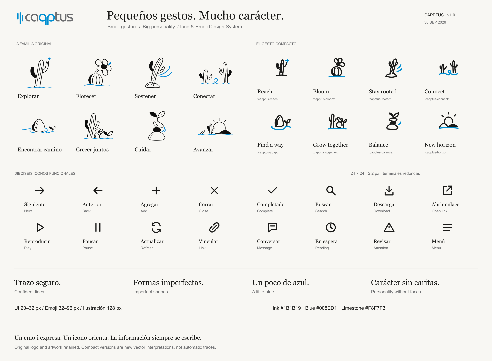
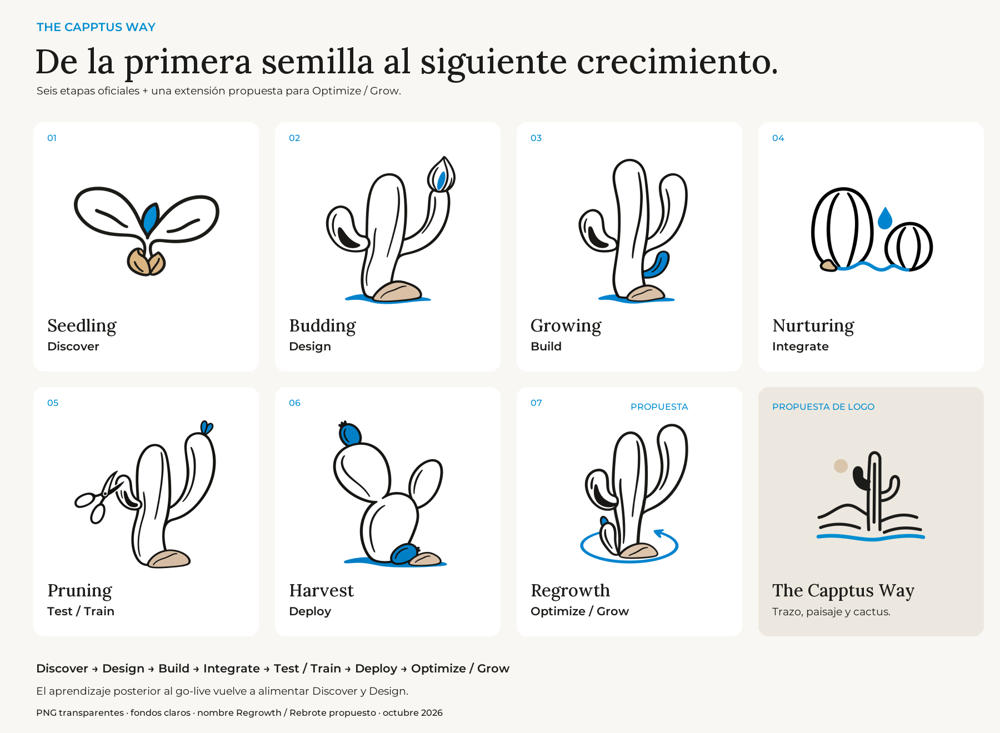
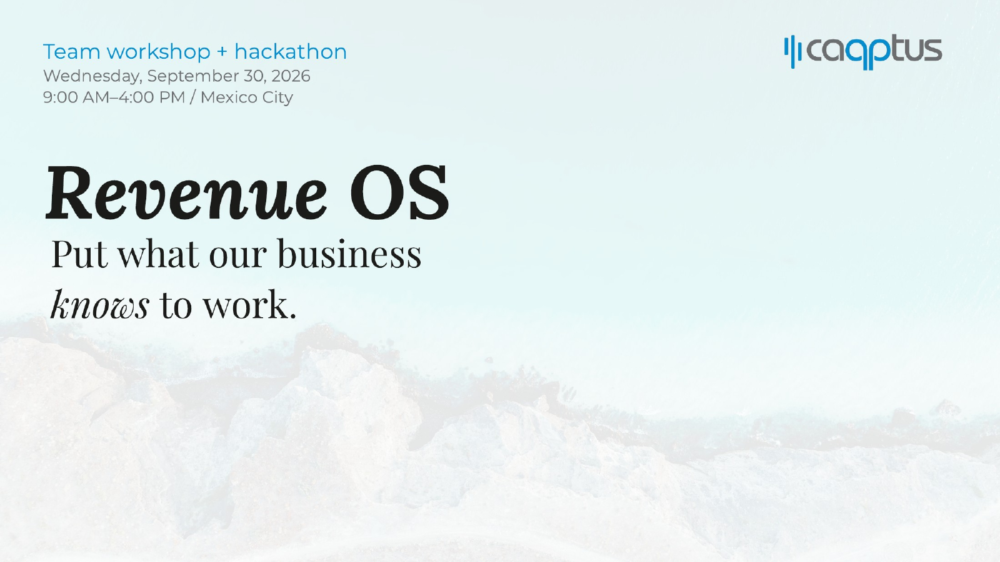
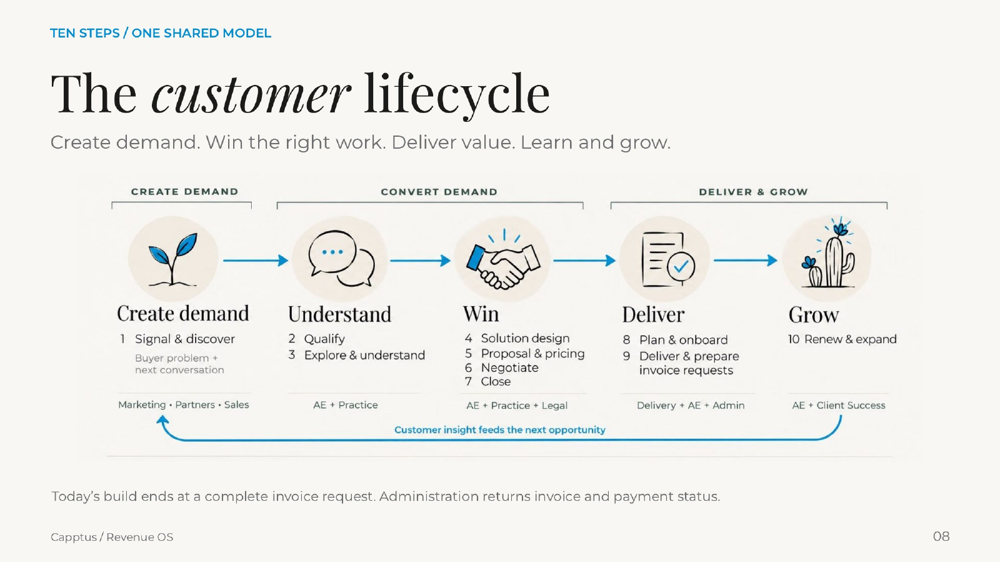
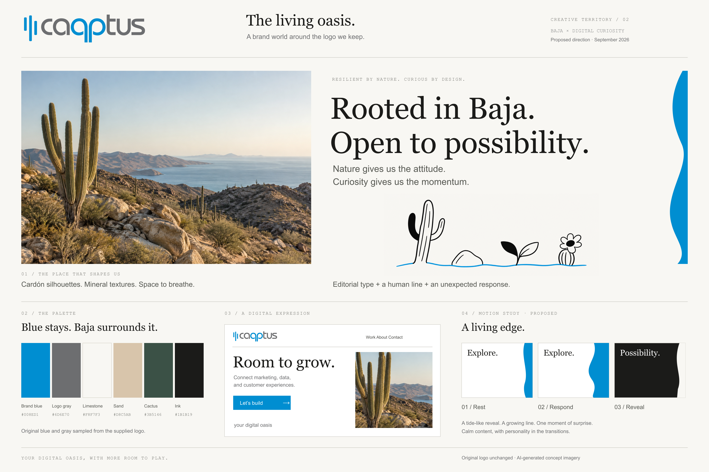

# Capptus Design System

The shared showcase for the Capptus work we have created: **The Living Oasis** direction, the illustration family, compact emojis, interface icons, and presentation layouts.



The original Capptus logo and illustrations are preserved. The compact designs and interface symbols are editable SVG artwork. Typography is approved: **Lora Medium (500)** for h1–h3, highlighted phrases, and quotations, with real **Lora Italic** for one or two emphasized headline words; **Montserrat Regular (400)** for body copy and **Medium (500) / SemiBold (600)** for UI and CTAs. The supporting palette remains proposed.

The reference boards and workshop images are archived examples created before this typography decision; their embedded typography has not been rebuilt. The live HTML showcase uses the approved pairing.

## The Capptus Way



**Discover → Design → Build → Integrate → Test / Train → Deploy → Optimize / Grow**

The first six stages use the official Seedling, Budding, Growing, Nurturing, Pruning, and Harvest narrative. The seventh is a proposed extension; **Regrowth / Rebrote** is its proposed narrative name. The set uses black organic linework, open interiors, and restrained blue and sand accents.

The accompanying logo is a proposal for **The Capptus Way**, with Lora + Montserrat; it does not replace the original corporate Capptus logo.

[Download the complete Capptus Way kit](downloads/Capptus-Way-Icons-v1.zip) · [Stage meanings and usage](docs/capptus-way.md)

## What is here

| Collection | Contents |
| --- | --- |
| Living Oasis | Creative direction v3 board, palette, and typography study |
| The Capptus Way | 7 transparent line-art PNGs; 6 official stages + 1 proposed extension |
| Capptus Way logo exploration | 2 editable SVG designs with PNG exports; proposed |
| Illustration family | 8 unchanged transparent raster illustrations |
| Compact emojis | 8 editable SVG masters, PNG 128/256 exports, and light tiles |
| Interface icons | 16 editable SVG masters on a 24px grid |
| In use | 4 selected Revenue OS workshop slide layouts |
| Digital foundations | Token source, CSS components, and accessibility guidance |

## The system in use





The same editorial typography, warm surfaces, blue gestures, and illustration language carry into a working presentation. These are selected design excerpts from the supplied Workshop Cut; client-specific working pages are outside this public showcase.

## Living Oasis direction



[Download the editable direction board](downloads/Capptus-The-Living-Oasis-Moodboard-v3.svg).

## Download the assets

- [Original icon and emoji kit ZIP](downloads/Capptus-Icons-Emojis-v1.zip)
- [Editable icon and emoji reference sheet](downloads/Capptus-Icon-Emoji-System.svg)
- [Asset catalog](assets/catalog.json)
- [Icon and emoji usage notes](docs/icon-emoji-usage.txt)
- [Icon and emoji tokens](tokens/icon-emoji.tokens.json)
- [Foundation tokens](tokens/tokens.json)

## Preview and use

Open `index.html` in a browser for the interactive showcase. Search in English or Spanish, filter by asset family, and download individual files. It works offline with locally bundled fonts and no external runtime dependencies. For a local server, run `python3 -m http.server 8080` from this folder and visit `http://localhost:8080`.

GitHub renders this visual README. The interactive HTML runs locally or on a separately configured static host.

Use `styles/tokens.css`, `styles/typography.css`, then `styles/components.css` in a website. Components use native HTML and namespaced `.cap-*` classes. The reference page stylesheet is separate from the reusable component styles.

```html
<link rel="stylesheet" href="styles/tokens.css">
<link rel="stylesheet" href="styles/typography.css">
<link rel="stylesheet" href="styles/components.css">
<a class="cap-button" href="/contact">Start a conversation</a>
```

## Repository map

- `tokens/tokens.json` — editable token source with status and provenance.
- `scripts/build.mjs` — generates CSS custom properties and the showcase page.
- `scripts/showcase.mjs` — editable gallery composition using the asset catalog.
- `styles/` — generated tokens, reusable components, and gallery layout.
- `assets/` — original logo, illustration/emoji/icon assets, reference boards, and selected slide layouts.
- `downloads/` — supplied ZIP and editable reference boards.
- `docs/foundations.md` — visual rules, accessibility decisions, and open decisions.
- `docs/provenance.md` — source records and asset hashes.
- `CONTRIBUTING.md` — how to change and review the system.
- `AGENTS.md` — rules for AI-assisted work in this repository.

## Verification

Node.js 20 or newer is sufficient; no package installation is required.

```sh
npm run build
npm run check
```

The check verifies generated CSS and HTML consistency, all 41 catalog records, file hashes, local links, the original logo, and contrast for the documented normal-text pairs. See [verification boundaries](docs/verification.md) for the checks performed and pending browser review.

## Ownership and publication

Target repository: [luchein-lab/design](https://github.com/luchein-lab/design).

No open-source license is granted by this starter. Public repository visibility does not itself authorize reuse of Capptus brand assets. An owner should confirm brand-asset licensing, maintainers, and release policy before a public package is distributed.

The bundled Lora and Montserrat files retain their SIL Open Font License notices in `assets/fonts/`. See [typography decisions](docs/typography.md) for roles, weights, layout principles, and tone.
